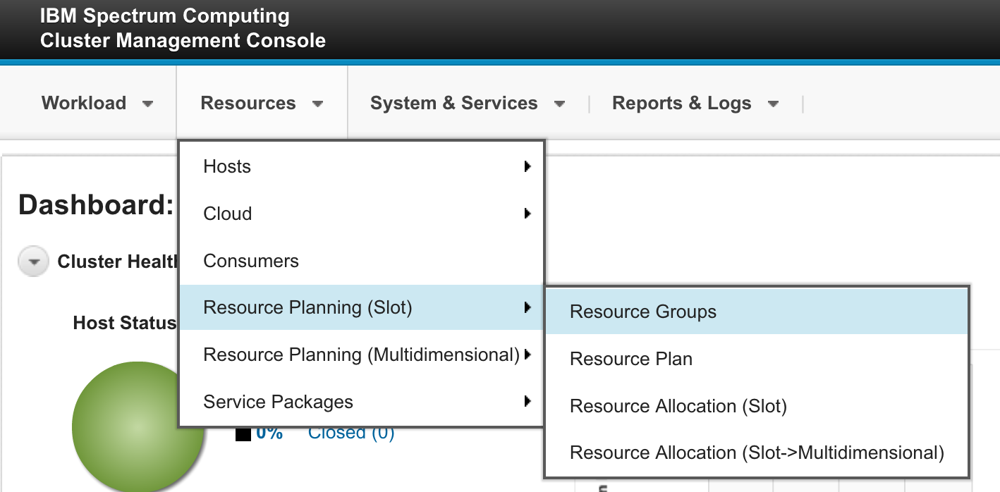
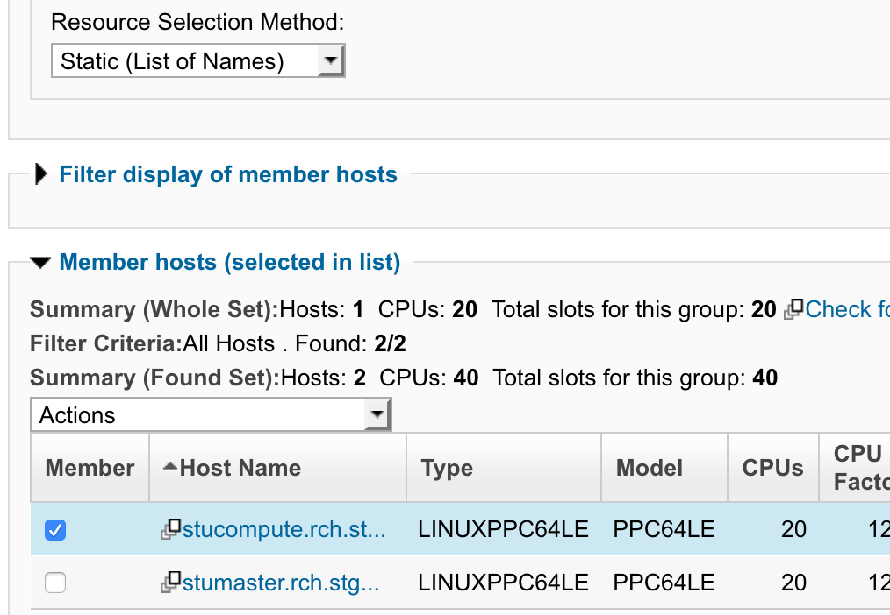
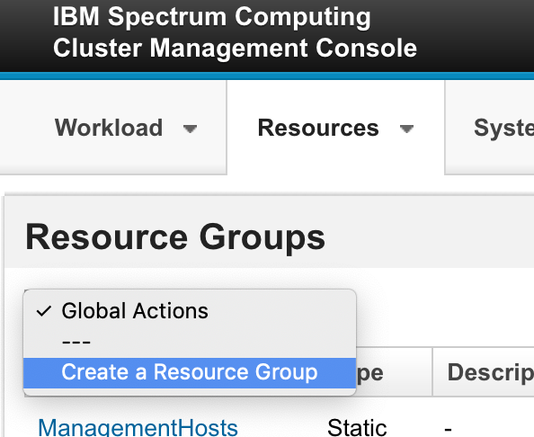
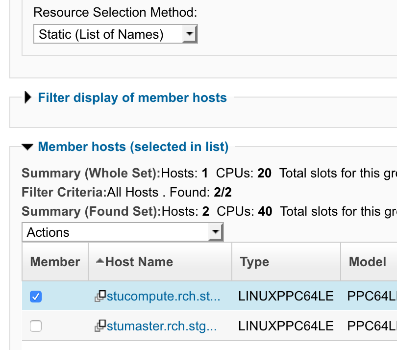
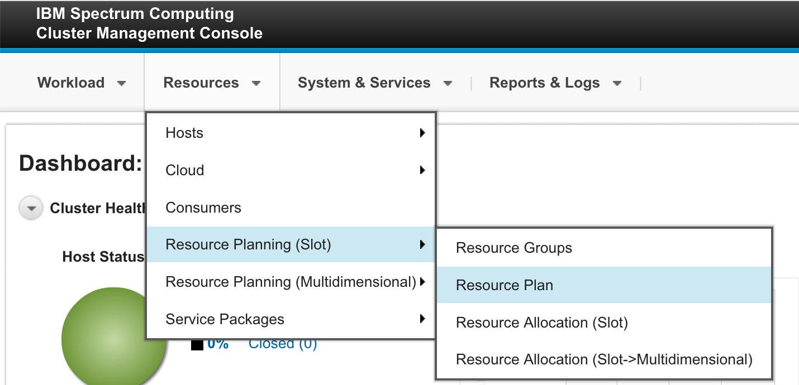
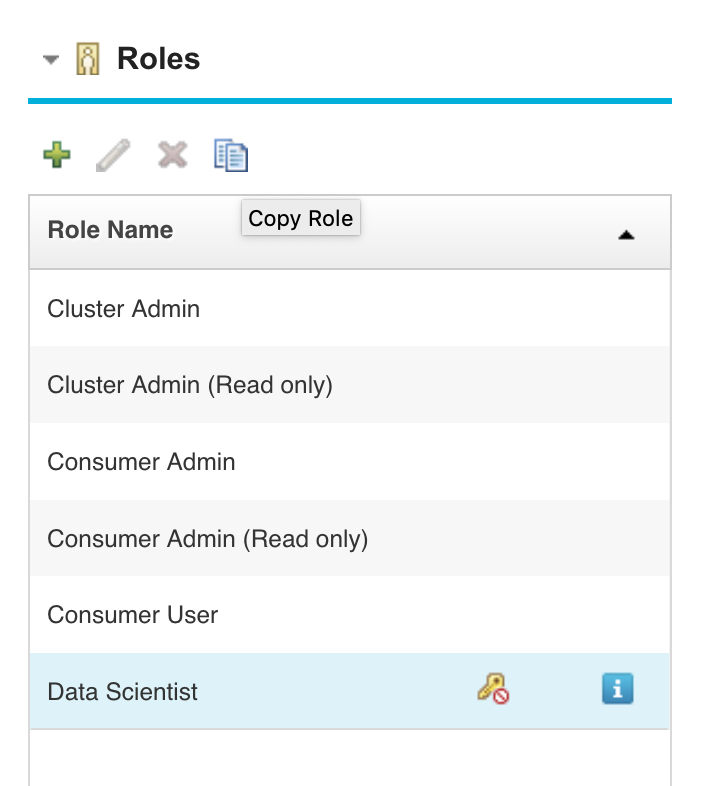
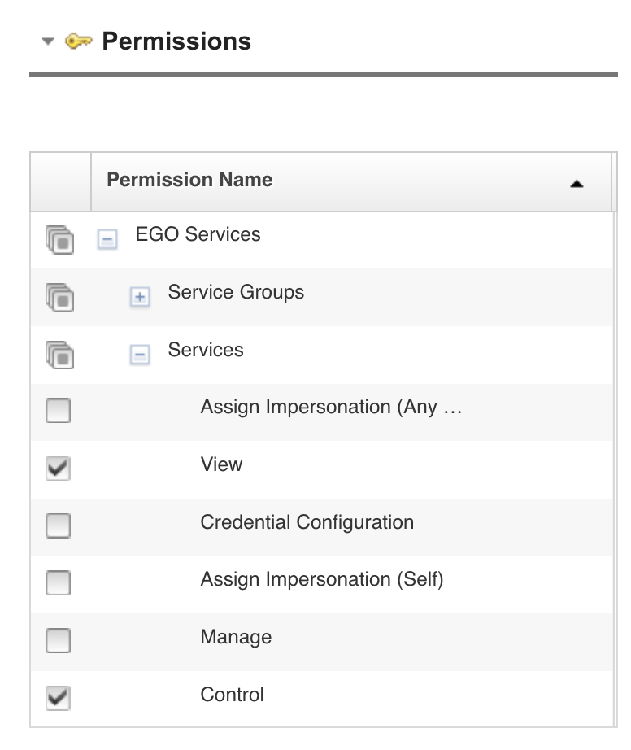

# Setting up WML-A base use cases

### Introduction

This guide contains the setup that Lab Services performs at customers after a standard WML-A installation with regards to creating consumers, anaconda environments, notebooks, instance groups. 

This guide also contains the tests that Lab Services performs in order to declare that the environment is working properly. This includes submitting a spark job, running a notebook, running a DLI workload.

## Step 1: Configure the resource groups

1.	Log on as the cluster Admin user

2.	Open up the Resource Group configuration:

3.	Select the ComputeHosts resource group:

4.	Properly configure the number of slots to a value that makes sense. If the server is an 8-thread capable system, use 7 * number of processors. If it’s a 4-thread capable system, go with 3 * number of processors:

5.	Optional, but recommended, change the resource selection method to static, and then select only the servers which will provide computing power (processor power) to the cluster:

6.	Click Apply to commit the changes.

7.	Create a new resource group:

8.	Call it GPUHosts

9.	The number of slots should use the advanced formula and equals the number of GPUs on the systems by using the keywork ngpus:

10.	Optionally, but recommended, change the resource selection method to static and select the nodes which are GPU-capable:

11.	Under the “Members Host” column, click on “preferences” and select the attribute “ngpus” to be displayed:

12.	Click on “Apply” and validate that the “Members Host” column now displays ngpus:

13.	Finish the creation of the resource group by clicking on “Create”

14.	Go to Resources -> Resource Planning (slot) -> Resource Plan:

15.	Change the allocation policy of the “ComputeHosts” resource group to balanced:

## Step 2: Configure the roles

1.	To start with, we create a role of a Chief Data Scientist. The reason for such is so that we create a role with intermediate privileges between an Admin account and a Data Scientist account. This Chief Data scientist role has the authority of a data scientist plus additional privileges to start/stop instance groups. The idea is that users do not need to go up to a cluster Admin in order to start/stop their instance groups, instead they have the Chief Data Scientist do so.

2.	Go to Systems & Services -> Users -> Roles:

3.	Select the “Data Scientist” role and duplicate it by clicking the duplicate button:

4.	Call the new role “Chief Data Scientist”:

5.	Select the “Chief Data Scientist” role and add a couple privileges:

 *	Conductor -> Spark Instance Groups -> Control

 *	Ego Services -> Services -> Control (exemplified below)

 *	Consumers and Resource Plans  -> Resource Plans -> View

